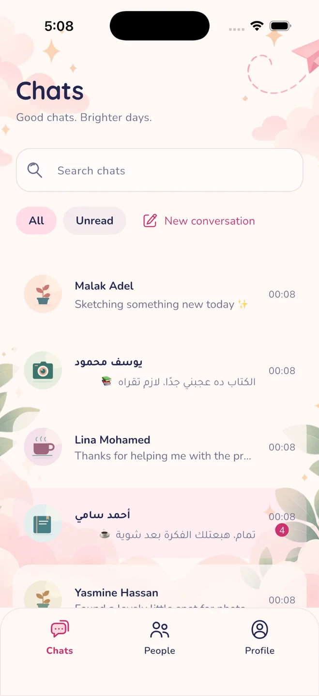
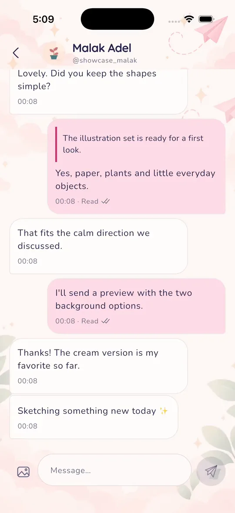
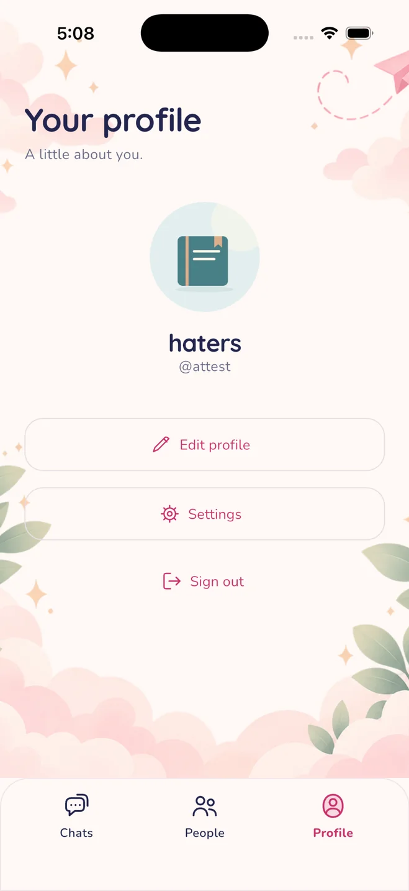
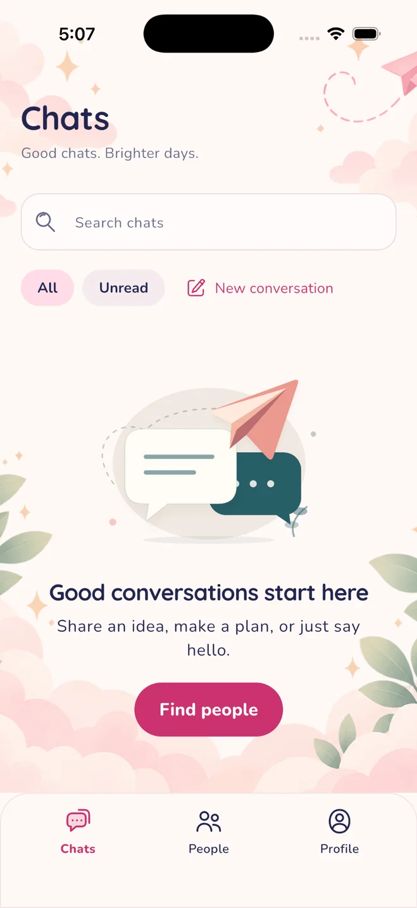

<div align="center">
  
  <h1>Mingle — A softer place to connect</h1>
  <p>An expressive Flutter messenger, documented from early product thinking to its next full-stack milestone.</p>
  <p><strong>Real iOS simulator captures · Flutter · NestJS · PostgreSQL · CI</strong></p>
  <p>
    <a href="https://husseinabozina.github.io/chat_app/"></a>
    <a href="docs/project/CURRENT_STATE.md"></a>
  </p>
</div>

## The app, as captured

The new [live product case study](https://husseinabozina.github.io/chat_app/) uses **real photos and two screen recordings** provided from a running iPhone 17 Pro simulator build, rather than recreated or fabricated interfaces.

<table>
  <tr>
    <td align="center"><br/><strong>Conversations</strong></td>
    <td align="center"><br/><strong>Direct messages</strong></td>
    <td align="center"><br/><strong>Profile</strong></td>
    <td align="center"><br/><strong>Empty state</strong></td>
  </tr>
</table>

Additional screenshots cover **launch, sign in, sign up, profile setup and people discovery**. Two optimized H.264 videos show the actual simulator flow; they are embedded with accessible native controls on the showcase site. Personal email text in the sign-up capture has been redacted for public display.

> **Implementation boundary:** User-supplied local simulator captures document a recent Mingle UI build. They are **not evidence that these same screens are merged into this GitHub repository's current `master` branch**. The version-controlled Flutter client still uses its legacy Firebase-backed chat experience. The separately implemented custom NestJS/PostgreSQL REST backend is not yet wired to the mobile UI; the approved Socket.IO protocol is not yet implemented. The project is in development, not a released public messaging service.

## Product direction

A small, intentionally focused messenger for one-to-one conversations, user discovery, profiles, messaging, thoughtful empty states and reliable sending/reading flows. Mingle's visual direction is **soft pastel minimal / playful social messaging** — friendly, expressive and distinctly not a dating app.

- [Product vision](docs/product/product-vision.md)
- [Product scope](docs/product/feature-scope.md)
- [Approved design language](docs/design/approved-ui-direction.md)
- [High-fidelity screen plan](docs/design/high-fidelity-screen-plan.md)

## Engineering

| Area | Verified repository status |
| --- | --- |
| Flutter client | Feature-first architecture, Cubit, domain repository contracts, Firebase adapters; legacy Firebase chat behaviour remains active. |
| NestJS REST API | Authentication, user search, direct conversations, durable text messaging, reply/edit/delete, read pointers, pagination and idempotency. |
| PostgreSQL | Explicit TypeORM migrations, no schema synchronization, tested backend data access. |
| Realtime | Socket.IO transport and event contract documented; gateway/publisher/E2E implementation is the next backend checkpoint. |
| Integration | Flutter REST/realtime adapters and redesigned multi-conversation flow **not yet merged**. |
| CI | Independent mobile and backend pipelines plus portfolio site validation/Pages deployment. |

**[Read CURRENT_STATE.md for the dated checkpoint log and the exact next work item.](docs/project/CURRENT_STATE.md)**

### Monorepo layout

```text
apps/
  mobile/                 Flutter / Dart application
  backend/                NestJS / TypeScript API
infra/
  docker-compose.yml      PostgreSQL local services
docs/
  api/                    REST and realtime contracts
  architecture/           data model and ADRs
  design/                 visual direction and screen plans
  product/                vision, user flows and scope
  project/                verified project status
  PORTFOLIO_SITE.md       showcase notes / media provenance
index.html                static portfolio page
site/
  assets/                 real edited simulator captures and videos
  styles.css
  main.js
  check.mjs
```

## Run the software locally

Start the PostgreSQL service from the repository root:

```bash
docker compose -f infra/docker-compose.yml up -d
```

Start the NestJS API:

```bash
cd apps/backend
cp .env.example .env
# Provide a strong local ACCESS_TOKEN_SECRET (at least 32 characters)
npm ci
npm run db:migrate
npm run start:dev
```

API health endpoint: `GET http://localhost:3000/v1/health`

Run the Flutter application **separately** with your Firebase setup:

```bash
cd apps/mobile
flutter pub get
flutter run
```

Preview the static showcase:

```bash
python3 -m http.server 4173
# Open http://localhost:4173/
node --check site/main.js
node site/check.mjs
```

## Delivery & quality

- Mobile CI: formatting, analyzer and Flutter tests.
- Backend CI: format, lint, typecheck, build, migrations and compiled-app E2E tests.
- Portfolio CI: static asset and content checks, GitHub Pages deployment from `master`.
- Responsive portfolio, reduced-motion support, interactive screenshot gallery and actual simulator MP4 playback.

The showcase is a **portfolio site**, not a publicly hosted chat service or APK. See [portfolio and media notes](docs/PORTFOLIO_SITE.md) for publishing details.

<div align="center"><sub>Flutter · NestJS · Small moments, carefully built.</sub></div>
