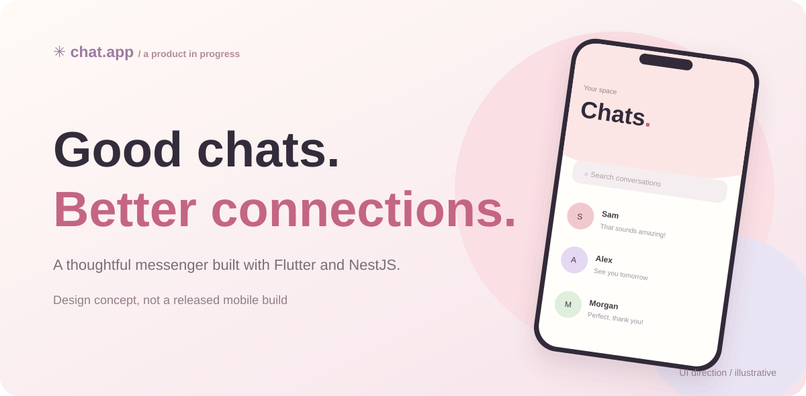

<div align="center">
  
  <h1>Chat App — Messaging, thoughtfully built</h1>
  <p>A focused one-to-one messaging product and an in-progress Flutter + NestJS engineering case study.</p>
  <p><strong>Design direction → domain boundaries → REST foundations → realtime → connected Flutter experience</strong></p>
  <p>
    <a href="https://husseinabozina.github.io/chat_app/"></a>
    <a href="docs/project/CURRENT_STATE.md"></a>
  </p>
  <p>
    
    
    
    <a href="https://github.com/Husseinabozina/chat_app/actions/workflows/mobile-ci.yml"></a>
    <a href="https://github.com/Husseinabozina/chat_app/actions/workflows/backend-ci.yml"></a>
  </p>
</div>

<a href="https://husseinabozina.github.io/chat_app/"></a>

> **Work in progress.** The current Flutter app still runs the legacy Firebase-backed chat flow; the new NestJS/PostgreSQL backend is implemented separately. The custom mobile-backend integration and Socket.IO realtime transport are not shipped. The showcase uses clearly labelled illustrative UI based on an approved design direction, **not runtime screenshots**.

## Product direction

A warm, focused messenger for **one-to-one conversations**, with the eventual experience covering sign-in, profiles, user discovery, conversations and clear text-message states. The planned aesthetic is soft pastel minimal: cream, blush, rounded surfaces, quiet backgrounds and abstract avatars — **not a dating app**.

The product scope is documented in [product vision](docs/product/product-vision.md), [feature scope](docs/product/feature-scope.md) and [approved design direction](docs/design/approved-ui-direction.md).

## Engineering status

| Area | Current reality |
| --- | --- |
| Flutter client | Feature-first auth and chat, Cubit, repository contracts, Firebase behind data adapters. Legacy messaging still active. |
| NestJS API | Auth, profile/user discovery, direct conversations, durable text messages, pagination, read pointers, edit and soft delete. |
| PostgreSQL | Explicit TypeORM migrations and backend integration/E2E tests. |
| Realtime | Socket.IO protocol contract approved; implementation **pending**. |
| Client integration | Custom REST/realtime Flutter adapters and new multi-conversation UI **pending**. |
| CI | Separate mobile and backend validation workflows. |
| Website | Responsive static case study with illustrative concepts and honest implementation boundaries. |

The authoritative checkpoint log is **[CURRENT_STATE.md](docs/project/CURRENT_STATE.md)**.

## Repository layout

```text
apps/
  mobile/           Flutter client
  backend/          NestJS API + PostgreSQL
docs/
  api/              API and realtime contracts
  architecture/     system decisions, data model, ADRs
  design/           approved UI direction and high-fidelity planning
  product/          vision, user flows and feature scope
  project/          milestone and status log
  PORTFOLIO_SITE.md presentation and publishing notes
infra/
  docker-compose.yml
index.html          static portfolio entry point
site/               site styles, interaction and illustrations
.github/workflows/  backend, mobile and showcase checks
```

## Run locally

Start PostgreSQL from the repository root:

```bash
docker compose -f infra/docker-compose.yml up -d
```

Run the NestJS API:

```bash
cd apps/backend
cp .env.example .env
# Set ACCESS_TOKEN_SECRET to a strong local secret (32+ characters)
npm ci
npm run db:migrate
npm run start:dev
```

The local API health check is `GET http://localhost:3000/v1/health`.

Run Flutter separately:

```bash
cd apps/mobile
flutter pub get
flutter run
```

**Note:** Flutter currently uses Firebase, not the custom REST API. Its Firebase setup must be configured for a local run. See [mobile](apps/mobile/README.md) and [backend](apps/backend/README.md) documentation.

Preview the portfolio site from the repository root:

```bash
python3 -m http.server 4173
# open http://localhost:4173
node --check site/main.js
node site/check.mjs
```

## Quality and deployment

- **Mobile CI:** Dart formatting, Flutter analyzer and tests.
- **Backend CI:** formatting, lint, type checking, compiled build, migrations and E2E tests.
- **Site CI:** JavaScript syntax, asset and link checks; GitHub Pages publish on `master`.

[Portfolio publishing guide](docs/PORTFOLIO_SITE.md) explains the first-time GitHub Pages setting and the rule against advertising screenshots/APKs that do not yet exist.

## Next checkpoint

Implement the approved backend Socket.IO gateway, authenticated session rooms, versioned post-commit events, typing TTL and compiled-app E2E coverage. **Do not** treat presence, push, media or Flutter realtime adapters as implemented in this step.

See [current state](docs/project/CURRENT_STATE.md) for the precise verified baseline and the next work item.

<div align="center"><sub>A personal product and engineering project. Site illustrations are concepts, not app captures.</sub></div>
